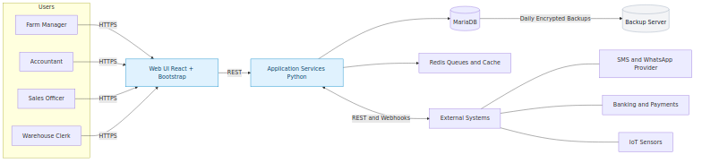
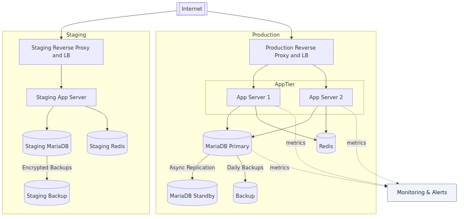
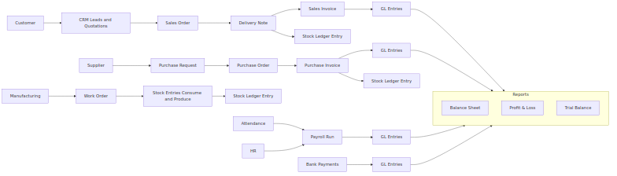
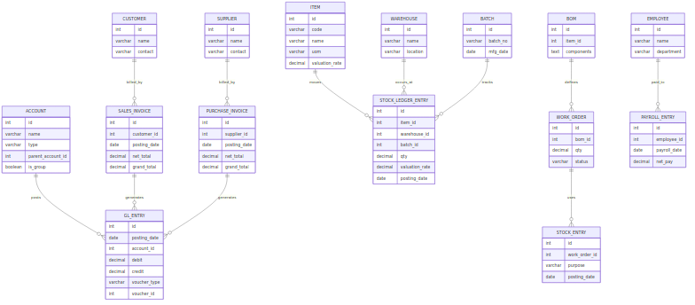
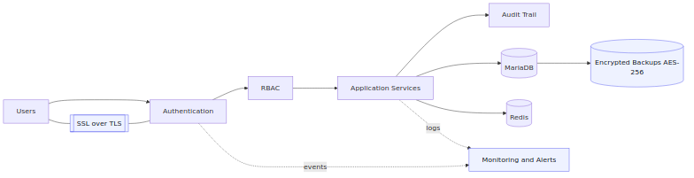
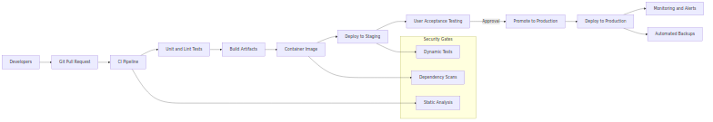

Custom ERP System — Overview for Begal Farm Harvest (BFH)
Date: August 2025
Prepared by: Analytics Business Centre

About This Document
This is a simple, non-technical overview of the new ERP system we are setting up for BFH. It explains what the system does, how the pieces fit together, and what benefits you will see day to day.

1) What the System Does
- Finance: Tracks income, expenses, bank reconciliations, and provides Profit & Loss and Balance Sheet.
- Inventory: Shows stock levels across warehouses, supports stock transfers, and keeps accurate item costs.
- Manufacturing: Plans and tracks feed production and poultry batches, with costs per batch and per bird.
- Sales: Manages customers, quotations, orders, deliveries, and invoices.
- HR & Payroll: Keeps employee records, attendance, leave, and runs payroll with correct calculations.
- Reports & Dashboards: Clear, real-time dashboards with export to Excel/PDF.

2) How the System Is Organized
Think of the system like a set of connected applications working together.

System overview

- People at BFH use the web screens (on computer, tablet, or phone).
- The application processes your requests and talks to the database.
- A fast service keeps background tasks moving (reminders, alerts, and scheduled jobs).
- The system can connect to other services like SMS, banks, or sensors when needed.

3) Where It Runs
We provide two environments:

- Staging: for testing and sign-off by BFH before going live.
- Production: the live system used every day, with daily backups and monitoring.

Deployment view

4) How Work Moves Through the System
Here is a typical data flow from Sales and Purchasing into stock and the accounts. Everything links automatically, so manual double entry is reduced.

Process flow

5) Your Key Records (High-Level)
The system holds master records like Customers, Suppliers, Items, Warehouses, Employees, plus transaction records like Invoices, Orders, and Stock Moves. This keeps reports accurate and consistent.

Data model (simple view)

6) Security and Access
- Secure login with strong password rules; optional two-factor authentication.
- Each person only sees what their role allows (for example: Accountant vs. Warehouse Clerk).
- All activity is logged so we can see who did what and when.
- Backups are encrypted and stored safely.

Security overview

7) Getting Data In and Out
- We can import old data from Excel/CSV files.
- The system can send messages (like reminders) via SMS/WhatsApp.
- Reports export to Excel/PDF.

8) Quality and Go-Live
- We test the building blocks and how they work together.
- You test the system in Staging before we go live.
- After go-live, we monitor the system and keep daily backups.

9) Ongoing Support
- We will handle updates, small changes, and add new features as BFH grows.

Appendix: How updates are delivered

