Implementation Architecture of a Custom ERP System
Prepared for: Begal Farm Harvest (BFH)
Date: August 2025
Prepared by: Analytics Business Centre

1. Executive Summary
This document outlines the software architecture and implementation structure of a tailored Enterprise Resource Planning (ERP) system designed for Begal Farm Harvest (BFH). The system consolidates operations into a unified platform, covering Finance, Inventory, Manufacturing, HR, Payroll, and Sales, ensuring:

- Full digitization of operational processes.
- Scalable and modular design for future growth.
- Real-time visibility into financials, inventory, and production.
- Farm-specific features such as poultry cycle management and feed cost tracking.
- Cloud-ready deployment for performance, availability, and data security.

2. Technical Architecture
2.1 System Overview
The ERP system follows a multi-layered architecture:

Layer | Technology Stack | Responsibilities
--- | --- | ---
Frontend (Client Layer) | JavaScript, React, Bootstrap, REST API integration, Mobile Responsive Design | Provides dashboards, data entry forms, analytics, mobile access
Backend (Application Layer) | Python-based modular framework | Business logic, workflows, rules engine, API endpoints
Database Layer | MariaDB (SQL-based, ACID compliant) | Data persistence, transactions, reporting queries
Background Services | Redis | Task queues, notifications, reminders, job scheduling
Integration Layer | REST API, Webhooks | Connects with external apps (SMS, banking, payment systems, IoT sensors)
Security Layer | SSL/TLS, RBAC, OAuth2 | Authentication, access control, encryption

System Overview Diagram

2.2 Backend (Application Layer)
Technology Core: Python-based modular framework.

Architecture Style: Service-oriented modules (each app handles a domain such as Finance, HR, or Manufacturing).

Core Features:

- Business Logic Engine – Implements domain-specific rules (e.g., payroll formulas, cost of goods sold, depreciation).
- Workflow Manager – Automates approvals (purchase orders, leave requests, stock transfers).
- Background Workers – Uses Redis queues for sending emails, SMS alerts, automated reminders, and batch jobs.
- API Services – RESTful endpoints for web/mobile frontend, plus hooks for third-party systems (banking, messaging, IoT).
- Reporting Engine – Generates both tabular and graphical reports with drill-down capabilities.

2.3 Frontend (Client Layer)
Technology Core: React + Bootstrap (responsive web), with optional mobile app wrapper.

Design Philosophy: Role-based, task-driven dashboards to minimize clutter.

Capabilities:

- Dashboards & KPIs – Visual charts for sales trends, feed costs, stock availability, payroll, and production efficiency.
- Forms & Transactions – User-friendly forms for creating invoices, recording expenses, stock entries, and payroll runs.
- Role-Based Views – Each user role (Farm Manager, Accountant, Sales Officer, Warehouse Clerk) only sees relevant menus, reports, and actions.
- Custom Reports Builder – End-users can filter, group, and export reports without developer intervention.
- Mobile-Responsive UI – Access via smartphones and tablets for field users.

2.4 Security Architecture
Authentication: Enforced strong password policy; optional 2FA.

Authorization: Role-Based Access Control (RBAC) at document and field level.

Encryption:

- SSL/TLS for all web traffic.
- Encrypted backups using AES-256.

Audit Trail: Every record mutation logged with timestamp, user, and action for compliance.

Security Diagram

2.5 Deployment Architecture

Environment | Purpose | Hosting Option | Notes
--- | --- | --- | ---
Staging | Internal user acceptance testing | Cloud (DigitalOcean, or Private VM) | Mirrors production setup
Production | Live system for BFH staff | Cloud or On-Premise | Daily backups, high availability enabled

Deployment Diagram

3. Core Modules
3.1 Finance & Accounting
Features: General Ledger, Chart of Accounts, Trial Balance, P&L, Balance Sheet, Bank Reconciliation.

Automation: Real-time posting from transactions (sales invoices, purchase bills, payroll).

Technical Note: SQL-driven reports, automated journal posting via backend service.

3.2 Inventory & Stock
Features: Multi-warehouse management, stock transfers, item master, valuation methods (FIFO, Moving Average).

Batch & Serial Tracking: Supports poultry batch IDs, feed lot numbers.

Automation: Auto-reorder levels with system-generated Purchase Requests.

3.3 Manufacturing (Feed & Poultry Production)
Feed Production:

- Define formulas (Bill of Materials).
- Generate Work Orders for production.
- Track actual vs. planned cost of feed.

Poultry Cycles:

- Track batches of birds.
- Record mortality and growth cycles.
- Calculate per-bird cost and profitability.

Technical Note: Backend BOM engine, costing algorithms, work order logic.

3.4 Sales & CRM
Leads, Quotations, Sales Orders, Delivery Notes, Invoices.

Customer database with full transaction history.

Linked to Finance (AR) and Inventory (stock deduction).

3.5 HR & Payroll
Employee master records.

Attendance, leave management, overtime tracking.

Payroll processor with salary structures and tax calculations.

Integration with Finance for automatic journal posting.

3.6 Reporting & Dashboards
SQL-driven reports with configurable filters.

Graphical dashboards for management KPIs.

Export to Excel/PDF.

Process and Data Flow Diagram

Data Model (High-Level)

4. Data Migration & Integration
Legacy Data Import: Tools for Excel/CSV migration.

Transformations: Python scripts to map old accounts and normalize data.

External Integrations:

- Messaging (SMS/WhatsApp) for reminders.

5. Testing & Quality Assurance
Unit Testing: Automated validation of key backend functions (e.g., payroll calculation).

Integration Testing: Ensure cross-module consistency (e.g., Sales → Inventory → Finance).

User Acceptance Testing (UAT): In staging environment before rollout.

CI/CD Pipeline

6. Deployment & Maintenance
Cloud/On-Premise Deployment depending on BFH’s preference.

Automated Daily Backups stored securely.

System Monitoring with alerts for downtime, errors, or unusual activity.

Ongoing Support with patches and module extensions as BFH grows.

